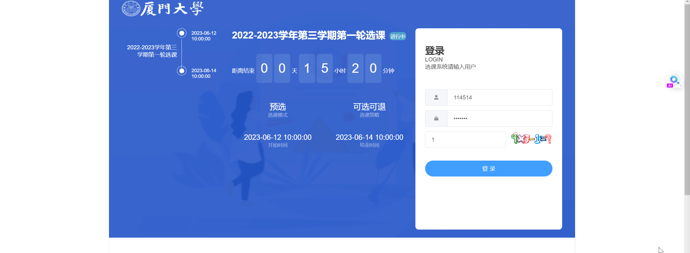

# XMUCourseEnroller
厦门大学选课系统抢课程序(尽可能ipynb上运行看结果)
# 主要思路
1. 向captcha网址发送post，将返回的base64编码的验证码图片在本地显示
2. 向login的链接发送登录请求，获得JWT验证token
3. 将token加入后续的请求头中
4. 向list发送请求，获得所有课程的密钥、classid、选中人数、课程上限、课程名、课程老师（这里需要解析json），这里需要把payload加入data
5. 向add或del的url发送post请求即可实现选课， 注意需要包装一个payload传入课程
   
> 需要注意的是,由于上传的密码会经过md5和base64加密，因此程序中的PASSWORD常量必须是在官网抓包login那个加密后的密码

# 当前功能
1. 登录并获得token
2. 读取任意课程类型，任意页的所有课程的信息
> 注意这里只需要读取一次，可以先登录和读取所有课程信息，然后就可以进行任意次的退课和选课操作了，不需要重新初始化一遍

3. 退课与选课操作
4. 循环抢课操作

# 待加功能
1. 多线程抢课（危）
2. 对单课程多教学班的适配
3. 志愿适配
4. gui可视化
5. 定时功能 比如每一段时间抓取课程信息观察各科老师受欢迎程度，以便及时避雷

# 示例

