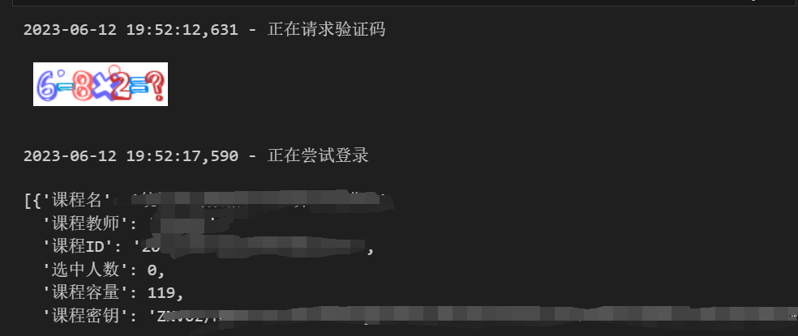

# XMUCourseEnroller
厦门大学选课系统抢课程序
# 主要思路
1. 向captcha网址发送post，将返回的base64编码的验证码图片在本地显示
2. 向login的链接发送登录请求，获得JWT验证token
3. 将token加入后续的请求头中
4. （可选）向list发送请求，获得所有课程的密钥、classid、选中人数、课程上限、课程名、课程老师（这里需要解析json），这里需要把preload加入data
5. 向add或del的url发送post请求即可实现选课， 注意需要包装一个preload传入课程
# 当前功能
1. 登录并获得token
2. 读取任意课程类型，任意页的所有课程的信息
3. 读取课程信息
4. 退课与选课操作
# 目前问题
1. 不明原因选课退课会报错500，但直接postman复制的结果却没问题
> 目前可用手动复制校验码来免于login 在bug解决前可以先用这个方法，坏处是得先手动登录一次
# 示例

